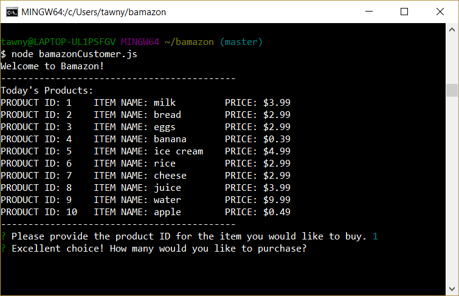
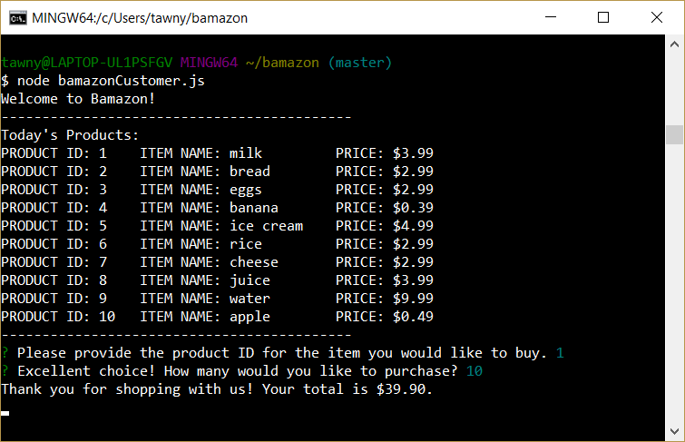
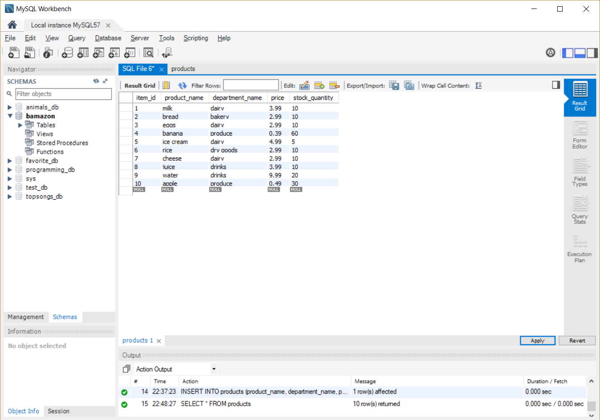
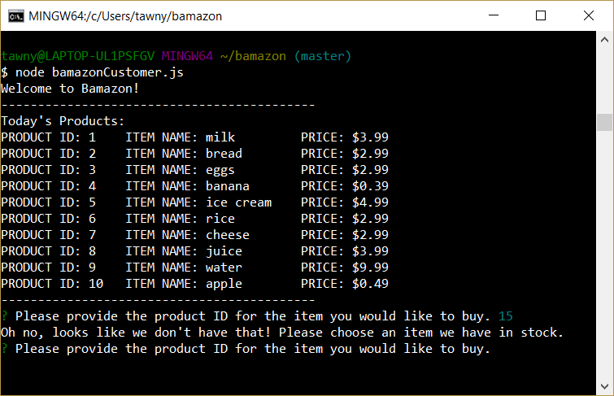
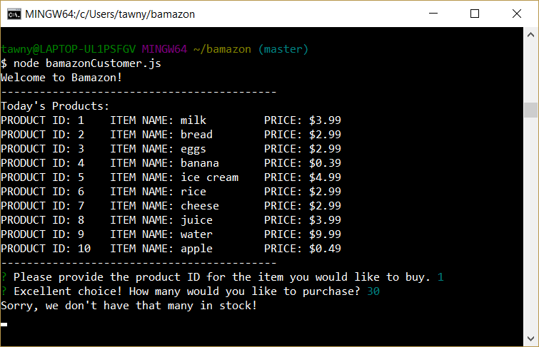

# Bamazon
Shopping using the command line!

## How it Works

* Start the application by typing "node bamazonCustomer.js" into the terminal. 

* You will then see all of the items currently in stock, its unique product ID and its price as provided by the MySQL database.
* To buy an item, enter the item's product ID. 
* After you have chosen an item, the program will also prompt you to choose the quantity that you would like to purchase. 

* Once the quantity is provided, the total price is calculated and shown.

* "Purchasing" the item also changes the quantity within the MySQL database. 

Before: 

After: 

* If you try to purchase an item that does exist in the database, you will receive this error:

* If you try to purchase a larger quantity of an item than exists in the store, you will receive this error:

