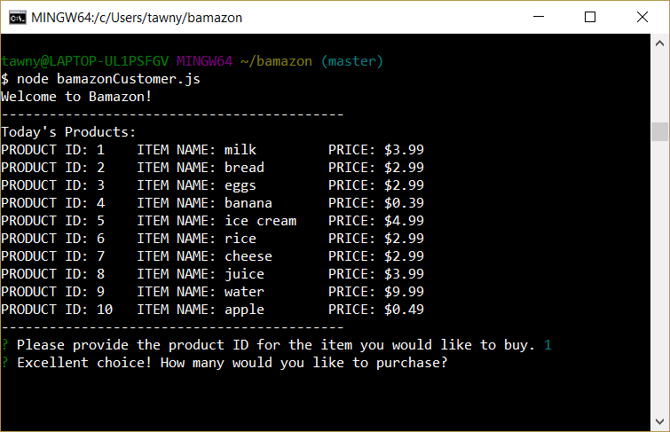

# Bamazon
Shopping using the command line!

## How it Works

* Start the application by typing "node bamazonCustomer.js" into the terminal. 

* You will then see all of the items currently in stock, its unique product ID and its price as provided by the MySQL database.
* The program will also prompt you to choose a quantity that you would like to purchase of the item. 

